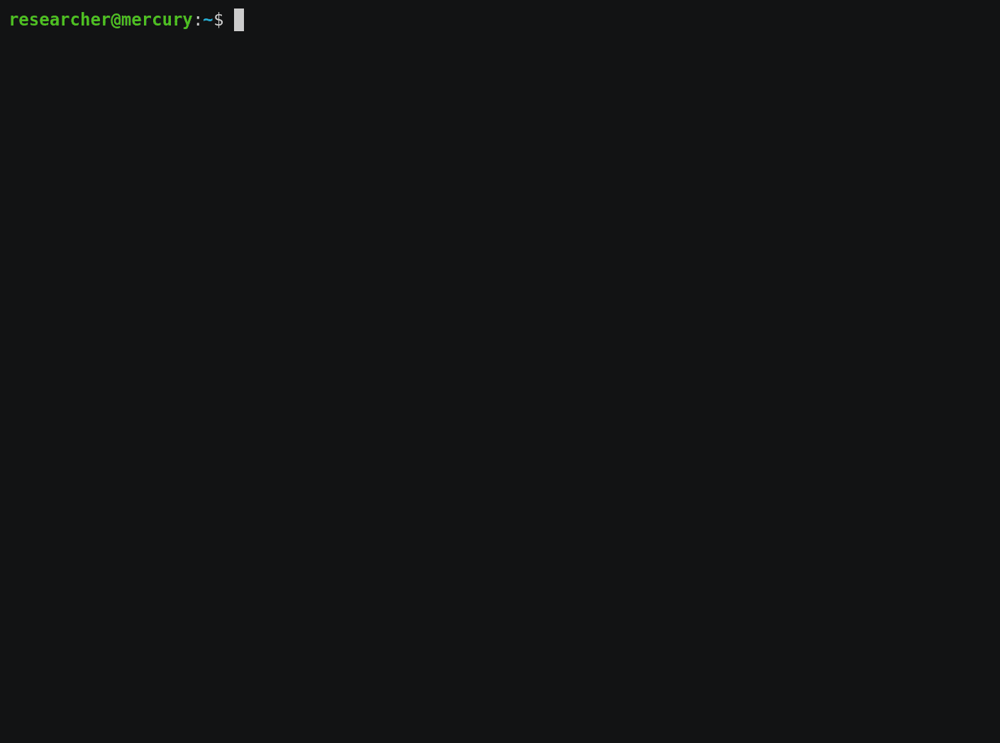

# Hekate - A VMWare Workspace ONE Access Remote Code Execution Exploit

- Steven Seeley of Qihoo 360 Vulnerability Research Institute
- Original rogue MySQL server by [LandGrey](https://landgrey.me/blog/11/)

## Details

- Hekate is pronounced as heh-ka-teh
- Date: Tue Feb 22 13:37:00 CST 2022
- Version: 21.08.0.1 (latest)
- File: identity-manager-21.08.0.1-19010796_OVF10.ova 
- File SHA1: 69e9fb988522c92e98d2910cc106ba4348d61851
- Further technical details: [https://srcincite.io/blog/2022/03/25/taking-on-a-new-identity-pwning-vmware-workspace-one-access.html](https://srcincite.io/blog/2022/03/25/taking-on-a-new-identity-pwning-vmware-workspace-one-access.html)

# Summary

An unauthenticated attacker can trigger a remote code execution as root against the vIDM appliance. Additionally, an attacker can send a specially crafted link to a victim operator that when clicked, can achieve remote code execution as root against the vIDM appliance.

# Notes

- The vulnerabilities in this exploit take advantage of the default configuration of VMWare Workspace ONE Access
- This repo contains two different exploits for leveraging two different techniques of exploitation:

    - MySQL JDBC Driver autoDeserialize
    - PostgreSQL JDBC Driver socketFactory

    The PostgreSQL attack technique has an added advantage that it doesn't require Java deserialization gadget for exploitation (even though one exists by default). As an additional advantage, you can use the [licensecheck-1.1.5.jar](/postgres/exploit/libs/licensecheck-1.1.5.jar) library to trigger a deserialization in the `com.vmware.licensecheck.LicenseChecker` class so that an out-of-band attack isn't required. Please see the specific [poc](/postgres/exploit) for that technique.

- The 4th vulnerability abused in this exploit is similar to CVE-2020-4006 which was used in the wild. The advantage in this exploit is that:

    - The bug impacts port 443, which is likely exposed unlike CVE-2020-4006 which impacts port 8443 and not likely exposed.
    - CVE-2020-4006 could not be triggered via cross site request forgery, the `X-Vk` header is expected and validated from the incoming request.
    - CVE-2020-4006 wasn't chained with additional vulnerabilities to achieve unauthenticated root access.

    This exploit uses 5 vulnerabilities to achieve a 0-click and 1-click remote code execution which will be detailed below.

    1. OAuth2TokenResourceController ACS Authentication Bypass ([CVE-2022-22956](https://srcincite.io/advisories/src-2022-0007/))

        CVSS: 9.8 (AV:N/AC:L/PR:N/UI:N/S:U/C:H/I:H/A:H)
        This vulnerability allows a remote, unauthenticated attacker to bypass the authentication mechanism and execute any operation.

    2. BrandingResource getBranding Information Disclosure ([CVE-2022-22961](https://srcincite.io/advisories/src-2022-0012/))

       CVSS: 5.3 (AV:N/AC:L/PR:N/UI:N/S:U/C:L/I:N/A:N)
       This vulnerability allows a remote, unauthenticated attacker to leak the hostname of the target system which can be used to target victims in a client-side attack scenario.

    3. DBConnectionCheckController dbCheck Cross Site Request Forgery ([CVE-2022-22959](https://srcincite.io/advisories/src-2022-0010/))

       CVSS: 8.8 (AV:N/AC:L/PR:N/UI:R/S:U/C:H/I:H/A:H)
       This vulnerability allows an attacker to induce users to validate an arbitrary JDBC uri's that they didn't intend to.

    4. DBConnectionCheckController dbCheck JDBC Injection Remote Code Execution ([CVE-2022-22957](https://srcincite.io/advisories/src-2022-0009/))

       CVSS: 9.1 (AV:N/AC:L/PR:H/UI:N/S:C/C:H/I:H/A:H)
       This vulnerability allows an attacker to deserialize arbitrary Java objects which can allow remote code execution.

    5. publishCaCert and gatherConfig Privilege Escalation ([CVE-2022-22960](https://srcincite.io/advisories/src-2022-0011/))

       CVSS: 8.8 (AV:L/AC:L/PR:L/UI:N/S:C/C:H/I:H/A:H)
       This vulnerability allows a local attacker with the uid 1001 to escalate their privileges to root access.

## Example

Attacking server-side using the PostgreSQL JDBC driver exploit:

Attacking client-side using the MySQL JDBC driver exploit:

